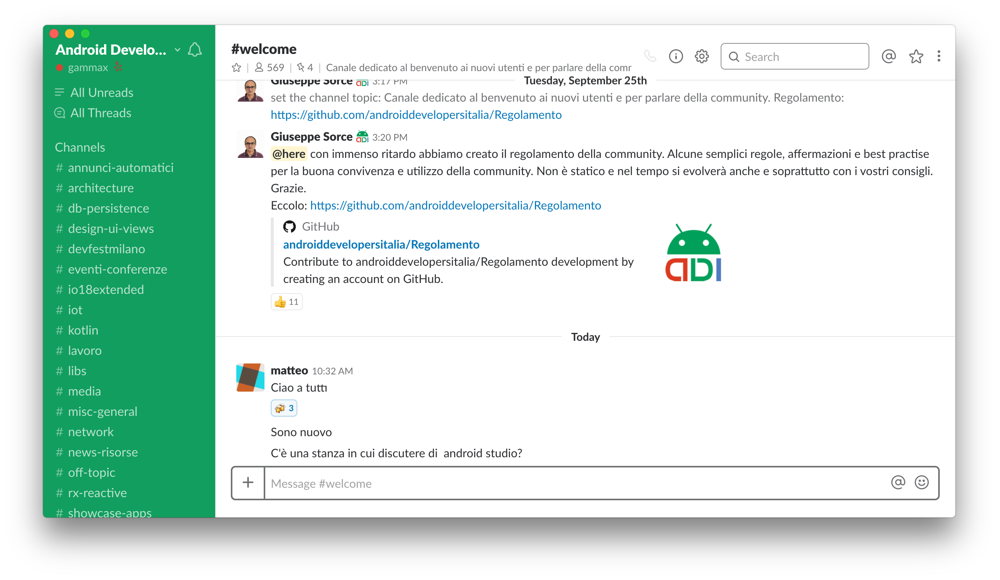

# androiddevelopersitalia.github.io
Pubic website for [androiddevelopersitalia.github.io](http://androiddevelopersitalia.github.io)

 [](https://opensource.org/licenses/MIT) [](http://twitter.com/AndroiddevsIt)

<!-- 
<p align="center">
  
</p> -->

Welcome to the ADI Pisa public website 🌎 The website is written with [Jekyll](https://jekyllrb.com/) and hosted on [GitHub Pages](https://pages.github.com/).

The website is publicly available on [http://androiddevelopersitalia.github.io/](http://androiddevelopersitalia.github.io). 

## Building the website locally 🛠

To get starting developing, we really recommend to clone the website locally and start developing on your machine. 

1. Install [Ruby](https://www.ruby-lang.org/en/) with your package manager.
```
brew install ruby
```

2. Clone this repository

3. To configure gems user-wide add the following line to your shell configuration files, for example `~/.bashrc` or `~/.zshrc`
```
export GEM_HOME=$(ruby -e 'print Gem.user_dir')
```

4. Open your terminal and install `jekyll`
```
gem install jekyll
```

5. Serve the website with the following command, 
```
jekyll serve
```

You should be able to see the local website at [http://127.0.0.1:4000](http://127.0.0.1:4000)

## Contributing 🤝

Feel free to contribute to this project!

Feel free to [open a issue](https://github.com/androiddevelopersitalia/androiddevelopersitalia.github.io/issues) or [submit a new pull request](https://github.com/androiddevelopersitalia/androiddevelopersitalia.github.io/pulls) ❤️

## License 📄

This project is licensed under the MIT License - see the [License](License) file for details